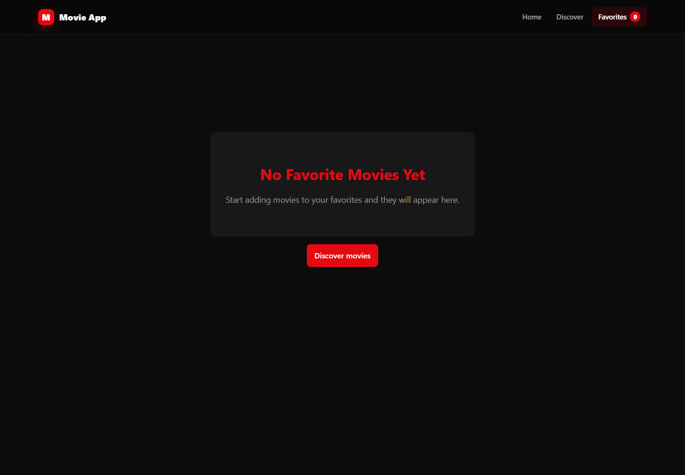
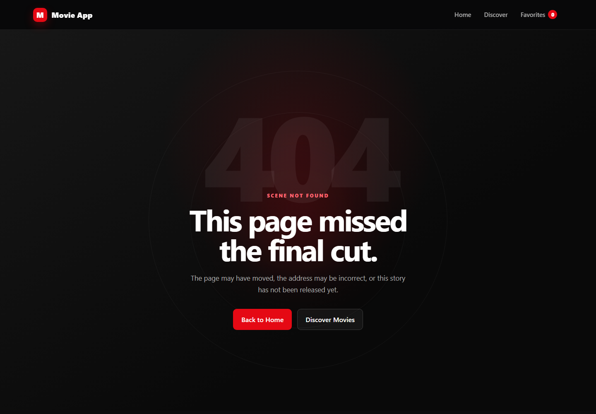

# Movie App

A responsive movie discovery application built with React and the TMDB API. Browse current releases, search and filter the catalog, explore movie and cast details, and save favorites between visits.

> Built as a frontend portfolio project focused on real API integration, shareable application state, reusable UI, accessibility, and resilient user feedback.

## Screenshots

| Favorites | Page not found |
| --- | --- |
|  |  |

The screenshots are captured from the responsive desktop interface. Add `home.png`, `discover.png`, and `movie-details.png` to `docs/screenshots/` after configuring a TMDB key if you want to showcase API-backed pages too.

## Live Demo

[View the deployed Movie App](https://your-project-name.vercel.app)

## Features

- Landing page with trending, popular, and upcoming movie collections
- Search with result counts, pagination, clear-search behavior, and no-results feedback
- Discover controls for category, genre, release year, minimum rating, and sort order
- URL-backed search, filter, sort, and page state for bookmarkable and shareable views
- Detailed movie pages with metadata, genres, trailer, principal cast, recommendations, and favorites
- Cast links to person pages with biography, birth information, department, profile image, and movie credits
- Persistent favorites with title/date/rating sorting, individual removal, and confirmed clear-all
- Loading skeletons plus dedicated error, empty, image-fallback, and friendly 404 states
- Responsive dark interface with keyboard focus styles, accessible labels, and reduced-motion support

## Technology

- React 19
- React Router
- Vite
- TMDB REST API
- Context API and `localStorage`
- Vitest, React Testing Library, and jest-dom
- Plain CSS with responsive media queries

## Architecture

```text
BrowserRouter
└── MovieProvider (favorites + localStorage synchronization)
    └── App
        ├── NavigationBar (route links + live favorites count)
        └── Routes
            ├── /                    Home
            ├── /discover            Discover
            ├── /favorites           Favorites
            ├── /movies/:movieId     MovieDetails
            ├── /people/:personId    PersonDetails
            └── *                    NotFound
```

### Data flow

```text
User interaction
      │
      ├── search/filter/page change ──> URL query parameters
      │                                      │
      │                                      v
      │                              page effect selects request
      │                                      │
      │                                      v
      │                              services/api.js ──> TMDB
      │                                      │
      │                                      v
      │                         loading / results / error UI
      │
      └── favorite action ──> MovieContext ──> React UI
                                    │
                                    └──> localStorage persistence
```

### Source layout

```text
src/
├── components/   Reusable cards, navigation, skeletons, and feedback UI
├── context/      Shared favorites state and browser persistence
├── css/          Global and page/component-specific styles
├── pages/        Route-level screens and their data orchestration
├── services/     TMDB request and response normalization layer
└── test/         Shared browser-test setup
```

The page components own request lifecycle state because each route has different data requirements. All TMDB calls remain centralized in `services/api.js`, keeping endpoint construction out of the interface. Favorites are global client state, so `MovieProvider` exposes a small action-based API and synchronizes it with browser storage.

## Download, set up, and run the project

### Prerequisites

- [Node.js](https://nodejs.org/) 20 or newer (npm is included with Node.js)
- A free [TMDB account and API key](https://www.themoviedb.org/settings/api)
- Git, if you plan to clone the repository instead of downloading a ZIP file

You can confirm that Node.js and npm are installed by opening a terminal and running:

```bash
node --version
npm --version
```

### 1. Download the project

Use either of these methods:

- On GitHub, select **Code > Download ZIP**, extract the ZIP, and open the extracted project folder.
- Or clone the repository from a terminal:

```bash
git clone <your-repository-url>
```

### 2. Open the frontend directory

This repository keeps the React application in the `frontend` folder. Run npm commands from that folder—not from the repository's parent folder.

```bash
cd "React Movie Tutorial/frontend"
```

If your downloaded folder has a different name, enter that folder and then enter `frontend`:

```bash
cd path/to/downloaded-project/frontend
```

You are in the correct directory when it contains `package.json`, `vite.config.js`, and the `src` folder.

### 3. Install dependencies

```bash
npm install
```

This reads `package.json` and installs React, Vite, the router, and the testing tools into a local `node_modules` directory.

### 4. Configure the TMDB API key

1. Sign in to TMDB and request an API key from the [API settings page](https://www.themoviedb.org/settings/api).
2. Create a file named `.env` directly inside `frontend`, beside `package.json`.
3. Add your key using this exact variable name:

```env
VITE_TMDB_API_KEY=your_tmdb_api_key
```

Do not add quotation marks or a trailing comma. If the development server was already running when you changed `.env`, stop and restart it so Vite loads the new value.

> Variables prefixed with `VITE_` are included in the client bundle. Treat this project as a client-side demo and use a server-side proxy if a credential must remain private in production.

### 5. Start the development server

```bash
npm run dev
```

Vite prints a local address, usually `http://localhost:5173`. Open that address in a browser. Keep the terminal running while using the application.

To stop the server, return to its terminal and press `Ctrl+C`.

### 6. Optional project checks

Before submitting changes, run:

```bash
npm test
npm run lint
npm run build
```

To preview the optimized production build after `npm run build`:

```bash
npm run preview
```

### Common setup problems

- **`ENOENT ... package.json`** — the command was run from the wrong folder. Change into `frontend` and try again.
- **The page loads but movie data does not** — confirm `.env` is inside `frontend`, the variable is named `VITE_TMDB_API_KEY`, and the server was restarted after adding it.
- **`npm` is not recognized** — install or update Node.js, then reopen the terminal.
- **Port 5173 is already in use** — use the alternate URL Vite prints, or stop the other development server.
- **Dependencies behave unexpectedly** — remove only the local `node_modules` folder, then run `npm install` again.


## Available scripts

| Command | Purpose |
| --- | --- |
| `npm run dev` | Start the Vite development server |
| `npm run build` | Create an optimized production build |
| `npm run preview` | Preview the production build locally |
| `npm run lint` | Check the source with ESLint |
| `npm test` | Run the test suite once |
| `npm run test:watch` | Re-run tests as files change |

## Testing

The initial test suite focuses on behavior with the highest regression value:

- restoring, adding, removing, deduplicating, and persisting favorites
- movie-card routing, metadata, poster URL construction, and accessible favorite state
- navigation options on the fallback route

```bash
npm test
```

Tests run in jsdom and exercise components through visible roles, labels, and user interactions.

## API notes

Movie data and images are supplied by [The Movie Database](https://www.themoviedb.org/). Requests are defined in `src/services/api.js`; movie-detail and person-detail requests use TMDB's appended responses to fetch related information with fewer network round trips.

This product uses the TMDB API but is not endorsed or certified by TMDB.

## Deployment

This application is deployed with [Vercel](https://vercel.com/) and automatically redeploys when changes are pushed to the `main` branch.

Deployment configuration:

- Root directory: `frontend`
- Framework preset: Vite
- Build command: `npm run build`
- Output directory: `dist`
- Environment variable: `VITE_TMDB_API_KEY`
- SPA routing is handled through `frontend/vercel.json`

## Future improvements

- Route-level lazy loading and code splitting
- Request caching and background refresh
- End-to-end tests for search, filters, and pagination
- A serverless API proxy with rate limiting
- TypeScript models for TMDB responses

## License

This repository is intended for educational and portfolio use. Add a license file before accepting external contributions or reuse.
